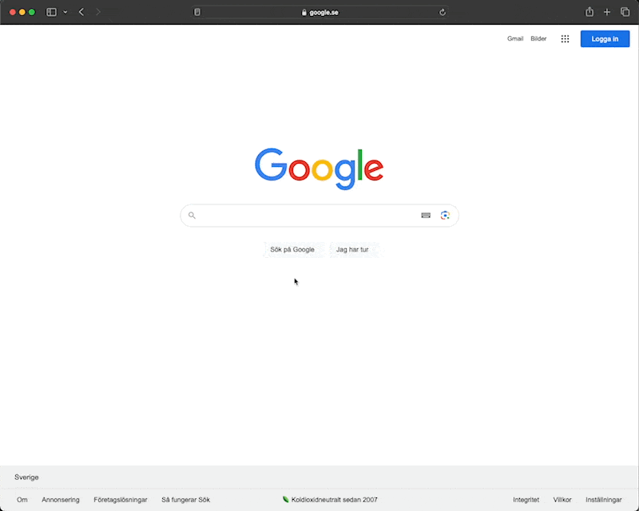

# Litium 8 for mac - MVC Accelerator & React Headless

This repository provides step-by-step instructions for installing Litium 8 on a Mac with ARM architecture, utilizing the Sonoma OS. Follow the guidelines in this documentation for a seamless installation process.

## Install dependencies
[For detailed instructions on installing Litium and its dependencies, click here.](./README_Dependencies.md)


## Create new litium MVC-Accelerator & Headless React project
Paste the code in terminal to create a new project. 🪄
```sh
/bin/bash -c "$(curl -fsSL https://raw.githubusercontent.com/robertbadas-columbus/litium/main/install/mac/install.sh)"
```

### Create website
Visit the provided URL below in your web browser and log in using the credentials. Locate the "Import" button, marked in blue, at the top-right corner. Click on it and be patient as the process completes; it may take some time.
<pre>
URL: <a target="_blank" href="https://localhost:5001/Litium/UI/settings/extensions/AcceleratorDeployment/deployment">https://localhost:5001/Litium/UI/settings/extensions/AcceleratorDeployment/deployment</a>
Username: admin
Password: nimda
</pre>


### Import Translations/Texts
- Go to link <a target="_blank" href="https://localhost:5001/Litium/UI/settings/websites/website?bc=website:website">https://localhost:5001/Litium/UI/settings/websites/website?bc=website:website</a>
- Double click on the row `localhost`
- Click the tab `Texts`
- Click the button `Import` and then `Select file`
- Select the file that has been created at `~/Desktop/LitiumTutorial/headless/litium-definitions/texts/xls/texts.xlsx`
- Click `OK`


## 🎉 Complete
There are two urls you can visit. The Headless React and MVC Accelerator page.

|     Headless React     |    MVC - Accelerator   |
| ---------------------- | ---------------------- |
| <a target="_blank" href="https://localhost:3001">https://localhost:3001</a> | <a target="_blank" href="https://localhost:5001">https://localhost:5001</a> |
|    |   |

## Relaunch the application. 2 step process.
1. Execute the following in the terminal.
```sh
cd $HOME/Desktop/LitiumTutorial/docker && docker-compose up -d &
cd $HOME/Desktop/LitiumTutorial/backend/Src/Litium.Accelerator.Mvc &&
dotnet run
```

2. Excute the following in a new terminal window.
```sh
~/.dotnet/tools/litium-storefront proxy --litium https://localhost:5001 --storefront http://localhost:3000 &
cd $HOME/Desktop/LitiumTutorial/headless &&
yarn dev
```

## Useful Links
- https://docs.litium.com/accelerators/react-accelerator/get-started
- https://docs.litium.com/accelerators/react-accelerator/storefront-cli
- https://docs.litium.com/platform/guides/how-to-create-pages-in-react-accelerator
- https://docs.litium.com/platform/guides/how-to-create-custom-blocks-in-mvc-accelerator
- https://docs.litium.com/platform/guides/how-to-create-blocks-in-react-accelerator
- https://localhost:5001/storefront.graphql

# We are Columbus
Columbus is a global digital advisory and IT services company with more than 1,600 digital advisors serving our customers worldwide. We bring digital transformation into your business, help maximize your value chain and position you to thrive far into the future.

Columbus’ offers end-to-end digital solutions within Strategy & Change, Cloud ERP, Digital Commerce, Data & Analytics, Customer Experience and Application Management that address the lifecycle and sustainability demands of the Manufacturing, Retail & Distribution, Food & Process industries.

We offer a comprehensive solution portfolio with deep industry knowledge, extensive technology expertise and profound customer insight. We have proven this through 30 years of experience serving more than 2,500 customers worldwide.<br>
[www.columbusglobal.com](https://www.columbusglobal.com)

<a href="https://www.columbusglobal.com"></a>
